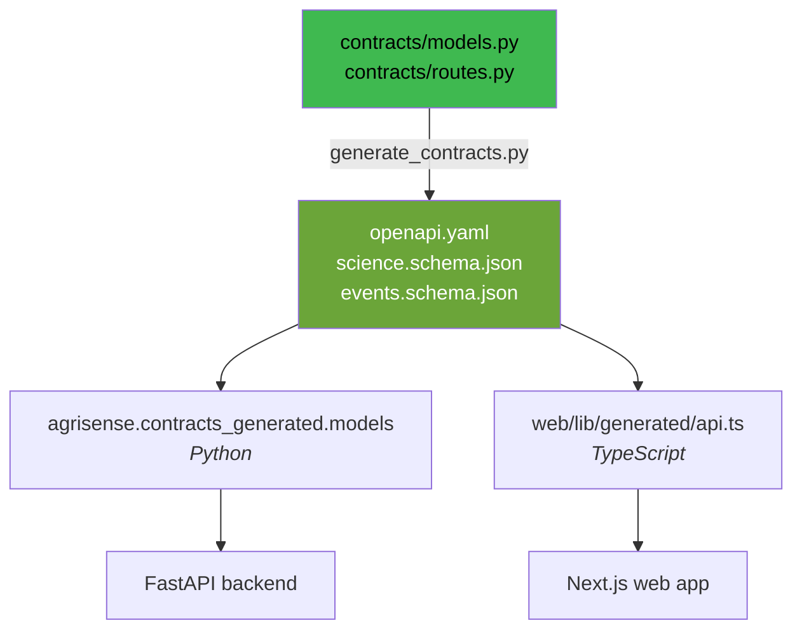

<div align="center">

# AgriSense

**Crop decision support for Indian farmers, in the language they use.**

AgriSense turns a field's location, crop and season into plain answers: what to sow, how much water it needs, when to go out, and what the season is worth.


<sub>IIT Ropar &nbsp;·&nbsp; ANNAM.AI with Syngenta and Google</sub>

<br><br>


</div>

---

## What it does

**Choose a crop.** Pick from a reviewed crop list, or ask AgriSense to suggest ones suited to your land. Each option shows how well it fits, how much water it needs, when to sow and when you would harvest.

**Know your water.** A day-by-day water plan for the season ahead, in litres for your own field rather than millimetres of depth.

**Know when to go out.** The window to work in, with the reasons behind it.

**Keep a field record.** Log watering, fertiliser, spraying and what you notice, with photos. Costs are totalled as you go.

**Ask questions.** By typing, by voice, or by photo, in Hindi, Marathi, Punjabi, Telugu or English. Also available over WhatsApp.

**See the market.** Live mandi prices for your crop, with the spread across reporting markets.

**Close the season.** Record what you actually harvested and sold, and see how the advice compared with what happened.

---

## Principles

**Unknown is never zero.** A figure AgriSense cannot work out says so, and says why. An empty bar would read as "no risk", which is a different claim.

**Every number says where it came from.** Weather, soil and market figures carry their source and the time they were read.

**No advice without evidence.** Where the underlying records do not support a recommendation, AgriSense declines to make one rather than guessing.

**Your records are yours.** Field data stays at field level, is exportable, and is deletable.

---

## How the principles are enforced

They are not a style guide. They are in the schema.

A measurement is not a number. `Measurement` requires `value` and `unit`, and `value` is explicitly nullable. When it is null, `missing_reason` says why. A UI cannot silently render a missing figure as `0`, because there is no `0` to render.

```jsonc
// contracts/science.schema.json  ->  $defs.Measurement
{
  "value":          number | null,   // required, nullable on purpose
  "unit":           string,          // required
  "missing_reason": string | null,   // why value is null
  "analyte":        string | null,
  "method":         string | null,
  "provenance":     Provenance[]     // where it came from
}

// $defs.Provenance
{
  "source":       string,   // required
  "data_mode":    string,   // required: measured, modelled, defaulted...
  "retrieved_at": string,
  "evidence_id":  string,
  "note":         string
}
```

`provenance` is a list, not a field, so a derived figure can carry every input it came from. `data_mode` is what keeps a modelled number from being read as a measured one.

The science layer is a set of **pure functions** behind `agrisense/science/facade.py`. Given a season snapshot, a forecast bundle and a reference bundle, it returns an evaluation. No I/O, no hidden state, so a recommendation can be replayed and checked against what actually happened at season close.

---

## Contract first

The API is not written twice. `contracts/` is the single authority, and both language bindings are generated from it:



Generated bindings are never hand-edited. Change `contracts/`, regenerate, and both sides move together or neither does.

Conventions the contract fixes across every endpoint:

| | |
|---|---|
| **Envelope** | Every response is `{data, meta}`; every error is `{error, request_id}` |
| **Auth** | Firebase bearer ID token; identity, tenant and role are never accepted in a body |
| **Writes** | Actor-scoped `Idempotency-Key` on POST |
| **Concurrency** | `expected_version` on PATCH, confirmation and close |
| **Lists** | `Envelope[Page[T]]` with a bounded `limit` and an opaque `cursor` |
| **Time** | UTC-aware ISO timestamps, local dates in `Asia/Kolkata`, intervals `[start_at, end_at)` |
| **Area** | A field's total area is never reused across simultaneous crops; each season carries its own `allocated_area_ha` |

---

## Layout

```
contracts/        the authority: OpenAPI 3.1, science and event schemas, fixtures
backend/
  agrisense/
    api/          FastAPI routes
    science/      pure evaluation functions behind facade.py
    agronomy/     crop and water models
    clients/      weather, soil and market integrations
    platform/     cross-cutting concerns
  migrations/     Alembic
services/
  crop-vision/    photo inference service, with its own model card
web/
  features/       one folder per surface: fields, plan, market, ask, journal,
                  closure, soil, economics, onboarding, channels, pwa, ...
science/
  training/       notebooks and training code
  evaluation/     harness
  model-cards/    what each model does and does not claim
infra/            Cloud Build and Cloud Run config
docs/             integration plan and manual test guide
```

---

## Running it

```bash
# backend
cd backend
uv sync
uv run alembic upgrade head
uv run uvicorn agrisense.main:app --reload

# web
cd web
npm install
npm run dev
```

After changing anything in `contracts/`:

```bash
backend/.venv/bin/python scripts/generate_contracts.py
```

`docs/TEAM_SETUP_AND_MANUAL_TESTING.md` has the full environment walkthrough.

---

## Status

Built for **HACK CORE 2026**, the national AI-in-agriculture hackathon at IIT Ropar run by ANNAM.AI with Syngenta and Google, where Team Underdawgs reached the on-campus finals. Deployed and in active development.

## Team Underdawgs

[Akasha Prasad](https://github.com/AkashaPrasad) &nbsp;·&nbsp; [Muneer Alam](https://github.com/Muneer320) &nbsp;·&nbsp; [Anoushka Wayangankar](https://github.com/anoushkawayangankar) &nbsp;·&nbsp; Jaideep &nbsp;·&nbsp; Hina
