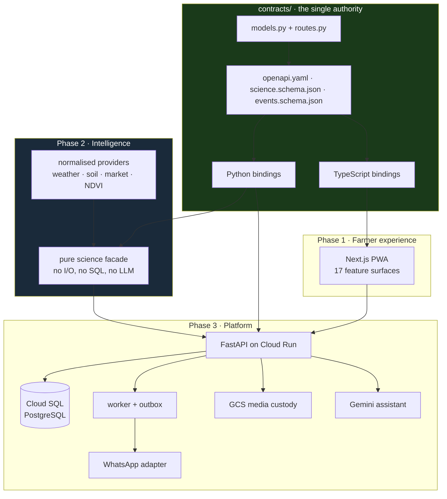
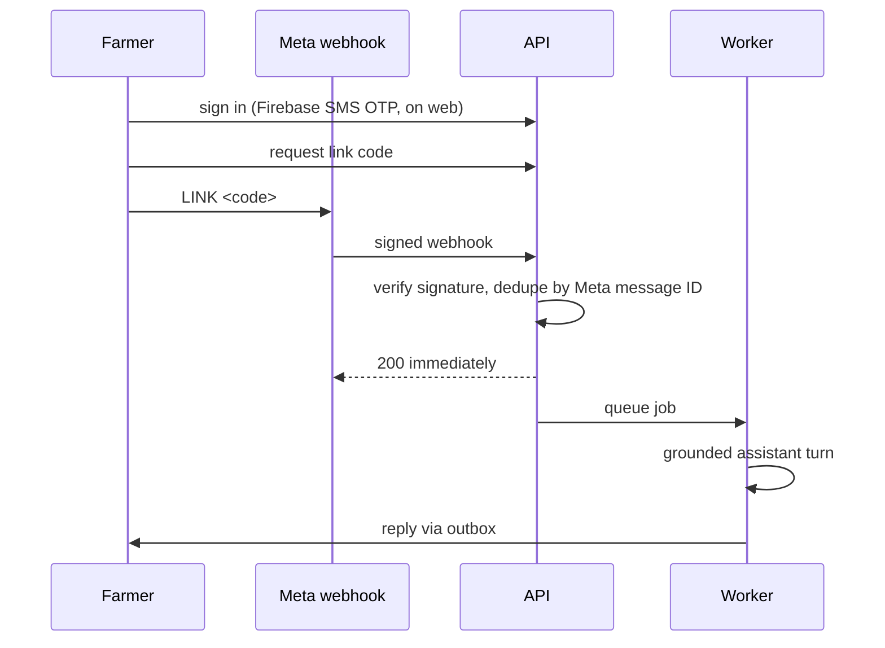

<div align="center">

# 🌾 AgriSense

### Crop decision support for Indian farmers, in the language they use.

**AgriSense turns a field's location, crop and season into plain answers:**
what to sow, how much water it needs, when it is safe to go out, and what the season was worth.

<br>


<sub>**FARM2FUTURE** · a national AI-in-agriculture hackathon at **IIT Ropar**<br>
run by **ANNAM.AI**, the Centre of Excellence for AI in Agriculture, with **Syngenta** and **Google**<br>
36-hour on-campus build sprint, 9 to 11 September 2026</sub>

<br>


<br>

<table>
<tr>
<td align="center"><b>61</b><br><sub>API operations</sub></td>
<td align="center"><b>155</b><br><sub>contract schemas</sub></td>
<td align="center"><b>312</b><br><sub>tests</sub></td>
<td align="center"><b>190</b><br><sub>commits</sub></td>
<td align="center"><b>5</b><br><sub>languages</sub></td>
<td align="center"><b>16</b><br><sub>science modules</sub></td>
</tr>
</table>

</div>

---

## The problem

A farmer in Punjab or Vidarbha has a phone, a field, and a decision to make this week. The information that would answer it exists: forecasts, soil surveys, mandi prices, product labels, agronomic research. None of it is in their language, none of it is about *their* field, and most of it arrives as a number with no indication of whether anyone actually measured it.

The failure mode is not "no data". It is **confident data that turns out to be a guess**, delivered in a way that looks identical to data that was measured.

AgriSense is built around refusing that.

---

## What it does

> **Choose a crop.** Pick from a reviewed crop list, or ask AgriSense to suggest ones suited to your land. Each option shows how well it fits, how much water it needs, when to sow and when you would harvest.
>
> **Know your water.** A day-by-day water plan for the season ahead, in litres for your own field rather than millimetres of depth.
>
> **Know when to go out.** The window to work in, with the reasons behind it.
>
> **Keep a field record.** Log watering, fertiliser, spraying and what you notice, with photos. Costs are totalled as you go.
>
> **Ask questions.** By typing, by voice, or by photo, in Hindi, Marathi, Punjabi, Telugu or English. Also available over WhatsApp.
>
> **See the market.** Live mandi prices for your crop, with the spread across reporting markets.
>
> **Close the season.** Record what you actually harvested and sold, and see how the advice compared with what happened.

<div align="center">

**English** · **हिंदी** · **मराठी** · **ਪੰਜਾਬੀ** · **తెలుగు**

</div>

---

## The four principles

<table>
<tr>
<td width="50%" valign="top">

### Unknown is never zero

A figure AgriSense cannot work out says so, and says why. An empty bar would read as "no risk", which is a different claim.

</td>
<td width="50%" valign="top">

### Every number says where it came from

Weather, soil and market figures carry their source and the time they were read.

</td>
</tr>
<tr>
<td width="50%" valign="top">

### No advice without evidence

Where the underlying records do not support a recommendation, AgriSense declines to make one rather than guessing.

</td>
<td width="50%" valign="top">

### Your records are yours

Field data stays at field level, is exportable, and is deletable.

</td>
</tr>
</table>

---

## How the principles are enforced

They are not a style guide. They are in the type system, the schema and the physics.

### 1. A measurement is not a number

`Measurement` requires `value` and `unit`, and `value` is **explicitly nullable**. When it is null, `missing_reason` carries why. A UI cannot silently render a missing figure as `0`, because there is no `0` to render.

```jsonc
// contracts/science.schema.json → $defs.Measurement
{
  "value":          number | null,   // required, nullable on purpose
  "unit":           string,          // required
  "missing_reason": string | null,   // why value is null
  "analyte":        string | null,
  "method":         string | null,
  "provenance":     Provenance[]     // a list, not a field
}

// $defs.Provenance
{
  "source":       string,   // required
  "data_mode":    string,   // required: measured | modelled | defaulted …
  "retrieved_at": string,
  "evidence_id":  string
}
```

`provenance` is a **list**, so a derived figure carries every input it came from. `data_mode` is what stops a modelled number being read as a measured one.

### 2. Blocked and unknown are different answers

The spray-window engine is documented as *"hard-gated hourly spray windows; soft scoring cannot reopen rejected hours"*. Its reason codes keep the two apart everywhere:

| Blocked | Unknown |
|---|---|
| `gust_exceeds_limit` | `gust_missing` |
| `rain_exceeds_limit` | `rain_missing` |
| `rain_probability_exceeds_limit` | `rain_probability_missing` |
| `inversion_detected` | `hourly_coverage_missing` |
| `delta_t_outside_limits` | `fresh_forecast_required` |
| `insufficient_equipment_time` | `interval_semantics_unconfirmed` |

"I checked and it is unsafe" and "I could not check" are never collapsed into one silence. Wet-bulb comes from Stull (2011) with the DOI cited in the docstring and a deliberately conservative domain that **raises rather than extrapolates** into the cold and dry corner.

### 3. Even the physics refuses to round up

The water model is an FAO-56 root-zone balance. Rice is the crop most of this region actually grows, and a puddled, continuously ponded paddy has no root-zone depletion to track at all. The code says so, in its own words:

> *"Treating it as a depletion balance is not conservative, it is undefined, which is why this used to answer nothing at all, and rice is the crop most of this region actually grows, so 'nothing' was the answer for most farmers asking about most of their water."*
>
> *"No depletion and no stress coefficient: a ponded field is not short of water, so reporting either would be inventing a number."*

The fix returns demand plus a **stated** percolation assumption, tagged `ponded_water_assumption_shallow_flooding`, rather than a depletion figure that would have been fiction.

### 4. The model cards argue against their own model

The crop-vision card records **78.6%** held-out accuracy and notes that the **95.4%** on the upstream model card is a different split. It then explains that the model was trained on single detached leaves on plain backgrounds, so a real field photo is out of distribution and its confidence there is not trustworthy in the way the headline number suggests. That limitation travels **in every response**, not just in the card.

The science card is blunter still:

> *No trained or field-calibrated production model is shipped. Readiness is not a success probability. Scenario quantiles are not calibrated prediction intervals. Source drought and nutrient indices are never fertilizer prescriptions.*

Default reference identity is `rules-only-unreviewed-v1`. Nothing pretends to be approved that is not.

---

## Architecture

Three parallel ownership streams behind one generated contract, not three sequential releases.



**The contract is generated, never hand-written twice.** Author changes in `contracts/models.py` and `contracts/routes.py`, run `scripts/generate_contracts.py`, and both language bindings move together or neither does. Generated files are never edited directly.

Conventions the contract fixes across all 61 operations:

| | |
|---|---|
| **Envelope** | Every success is `{data, meta}`; every error is `{error, request_id}` |
| **Identity** | Firebase bearer ID token. Identity, tenant and role are **forbidden in request bodies** |
| **Writes** | Actor-scoped `Idempotency-Key` on every POST |
| **Concurrency** | `expected_version` on PATCH, confirmation and close |
| **Lists** | `Envelope[Page[T]]`, bounded `limit`, opaque `cursor` |
| **Time** | UTC-aware ISO timestamps, local dates in `Asia/Kolkata`, intervals `[start_at, end_at)` |
| **Area** | A field's total area is never reused across simultaneous crops; each season owns its `allocated_area_ha` |

A hard rule runs through `AGENTS.md`: **never recreate scientific constants in the platform, or authoritative calculations in JavaScript.** One source of truth per number.

---

## The science layer

Ten workstreams, all rules-based and deterministic. Provider I/O sits strictly outside pure evaluation: no science function queries SQL or asks a language model for a number.

| | Workstream | Built |
|---|---|---|
| **P2-01** | Weather providers | CE Hub hourly/daily, Open-Meteo explicit fallback, bounded transport, typed meteoblue reanalysis |
| **P2-02** | Data normalisation | Soil, market and NDVI unit and quality transforms; catalog identity loader |
| **P2-03** | Stress algorithms | Source vs advisory distinctions, stress boundaries, nutrient diagnostics |
| **P2-04** | Water | FAO-56 root-zone balance, area and unit properties, ponded-paddy handling |
| **P2-05/06** | Suitability and windows | Product and stage gates, hourly continuity, rainfast after spray end, gust, inversion, delta-T and equipment-time checks |
| **P2-07** | Planning | Reference gates, remaining area, water, budget, soil and climate checks |
| **P2-08** | Economics | Decimal budget arithmetic, paired scenarios, ROI and loss, closure margin correction |
| **P2-09** | Learning | Forward farmer and field separation, label-availability gates, baseline and XGBoost CLI, conformal metrics, shadow weather bias, promotion guard |
| **P2-10** | Verification | Scoped science tests, live provider checks, CPU benchmarks for windows and the full facade |

The entire surface is a handful of **pure functions** behind `science/facade.py`. Given a season snapshot, a forecast bundle and a reference bundle, they return an evaluation. No hidden state, so any recommendation can be replayed and checked against what actually happened at season close.

Splits in the offline learning job **separate farmers and fields and move forward in time**. Future features and synthetic-to-empirical contamination are rejected by construction. Promotion requires empirical outcomes, preregistered comparison criteria, no hard safety violations, subgroup review, and an authorised reviewer tied to an immutable evaluation. **The validation utility cannot modify a live model.**

---

## WhatsApp, as a first-class channel

Most farmers in the pilot geography will never open a web app. WhatsApp is not a notification bolt-on here; it is a full client against the same contract.



Design decisions that matter:

- **Acknowledge fast, work later.** The webhook verifies the signature, deduplicates by Meta message ID, returns 200, and queues. No side effect happens before deduplication.
- **A number is never guessed.** A WhatsApp number is bound to a farmer only by redeeming a one-time code from an already authenticated session. Never inferred from display name or message text.
- **Mutations need a tap.** Anything the assistant proposes becomes a proposal with Confirm and Cancel quick replies, and confirmation calls the version-checked endpoint.
- **The channel does not diagnose.** It formats at the boundary only. It never invents an agronomic action.

Commands cover menu and help, field listing and switching, readiness, water, money, recent history, `log watered 20 mm`, `log sprayed`, `remind <ISO datetime>`, and a guided `close`. Images and voice notes are downloaded, validated and passed through the same media custody flow as the web app.

---

## Built

<table>
<tr><td width="50%" valign="top">

**Contract and platform**
- 49 paths, 61 operations, 155 schemas, OpenAPI 3.1
- Generated Python and TypeScript bindings
- FastAPI on Cloud Run, Cloud SQL PostgreSQL, Alembic
- Firebase phone and SMS OTP identity, tenant isolation
- Worker, outbox, reminders, notifications
- GCS media custody with access control
- Rate limits, privacy, analytics, structured errors

</td><td width="50%" valign="top">

**Science and intelligence**
- 16 deterministic science modules, 7 agronomy modules
- FAO-56 water balance with ponded-paddy handling
- Hard-gated hourly spray windows
- Crop planning with explicit exclusions
- Decimal economics, paired scenarios, ROI
- Offline yield training CLI with conformal metrics
- Bias and shadow-weather monitoring
- Model cards for every claim

</td></tr>
<tr><td width="50%" valign="top">

**Farmer experience**
- Next.js PWA, 17 feature surfaces, full-width responsive
- Onboarding, fields, seasons, planning, readiness
- Water, economics, market, journal, closure
- Grounded assistant with text, voice and photo
- Public `algorithm-notes` methodology page
- Agronomist console with stress map and backtests
- Playwright coverage of public routes and PWA

</td><td width="50%" valign="top">

**WhatsApp channel**
- Signed webhook verification and deduplication
- One-time link codes bound to authenticated farmers
- Full command surface with interactive replies
- Versioned journal entries tagged `source: whatsapp`
- Proposal confirm and cancel round trip
- Reminders through the shared contract
- Media download into the custody flow
- Outbox drain gated behind explicit live-send mode

</td></tr>
</table>

---

## Planned

The honest part. Work that is designed and specified but **not** finished, in the team's own priority order.

| Area | Planned | Blocked on |
|---|---|---|
| **Agronomist sign-off** | Reviewed regional crop calendars, per-hectare cost records, product-label constraints, spray-safety certification | An agronomist. Candidates sit in `crop-calendar-research.json`, quarantined from production and marked pending review |
| **Economics ranking** | Crop ranking on paired yield, price and cost records | Regional citable records. CACP figures alone are not enough |
| **Water model** | Full flooded-paddy and AWD management model, dated daily water contract, CE ET0 equivalence | Reviewed ponded-water management parameters |
| **Learning** | Hierarchical NumPyro and SHAP pipeline, subgroup evaluations, quantile jobs | Real labels and agreed review criteria. No automatic promotion, ever |
| **Providers** | Persistent cache and archive, station contract, live market and satellite schemas | External entitlements |
| **Deployment** | Production API and frontend release, live verification | A least-privilege Cloud Build service account. The owner account is deliberately not used |
| **WhatsApp** | Live Meta send verification, approved templates for proactive messages outside the 24-hour window | Meta approval. The test number is limited to five verified recipients |
| **Compliance** | Real privacy policy, production security review | Human sign-off before any public use |

Two lines from the roadmap set the standard the team held itself to:

> *No trained model or reviewed farmer recommendation is claimed. A passing arithmetic or software fixture does not satisfy empirical validation.*

> *Unsafe inferred values are not a compatible substitute.*

---

## Layout

```
contracts/          the authority: OpenAPI 3.1, science + event schemas, fixtures
  contract_v1.md    the integration rules every phase agreed to

backend/
  agrisense/
    api/            FastAPI routes and typed errors
    science/        16 pure modules behind facade.py
    agronomy/       constants, scoring, timing, viability, projection
    platform/       auth, db, worker, media, whatsapp, assistant, privacy, limits
    clients/        provider integrations
    contracts_generated/   never hand-edited
  migrations/       Alembic
  tests/            312 tests

services/crop-vision/   MobileNetV2 → ONNX, own model card, scales to zero

web/
  app/              17 routes, App Router
  features/         onboarding · fields · planning · readiness · water ·
                    economics · market · journal · closure · ask ·
                    agronomist · channels · account · soil · crops · auth · pwa
  lib/generated/    never hand-edited

science/
  reference/        parameters, crop calendars, soil estimates, sources
  training/         offline yield job
  evaluation/       harness
  model-cards/      what each model does and does not claim

workstreams/        phase-1 · phase-2 · phase-3
                    progress, decisions, handoff, interface-requests, test-evidence
infra/              Cloud Build and Cloud Run
```

`workstreams/` is worth opening on its own. Cross-owner changes were requested in `interface-requests.md` rather than reached for directly, and every phase kept a running decision log. That is why three people could build against one contract in 36 hours without stepping on each other.

---

## Running it

```bash
# backend
cd backend
uv sync
uv run alembic upgrade head
uv run uvicorn agrisense.main:app --reload

# web
cd web
npm install
npm run dev
```

After any change under `contracts/`:

```bash
python scripts/generate_contracts.py
```

Enable the shared hook once per clone. It blocks commits CI would reject, and any staged secret:

```bash
git config core.hooksPath scripts/hooks
```

No credentials live in this repository. `docs/TEAM_SETUP_AND_MANUAL_TESTING.md` has the full walkthrough.

---

## What this is not

- **Not a certified agronomic advisor.** No production-safe spray window can be certified while required label and agronomist evidence is missing, and the code refuses rather than pretending.
- **Not a diagnosis.** The vision model identifies patterns in laboratory-style leaf photographs. It is not a medical-grade or field-calibrated diagnostic.
- **Not a trained yield predictor.** The learning pipeline exists and runs. It has not been trained on real outcomes, and nothing promotes a model without human review.
- **Not deployed to real farmers.** Pilot geography is Punjab and Vidarbha; core crops are rice, wheat and cotton. Everything past that needs reviewed regional evidence.

---

<div align="center">

## Team Underdawgs

**[Muneer Alam](https://github.com/Muneer320)** · **[Akasha Prasad](https://github.com/AkashaPrasad)** · **[Anoushka Wayangankar](https://github.com/anoushkawayangankar)** · **Jaideep** · **Hina**

<br>

**189 of the 190 commits here landed inside the 36-hour sprint** at **IIT Ropar**.
One of the on-campus finalist teams at **HACK CORE 2026**.

<sub>Thanks to IIT Ropar, ANNAM.AI, Syngenta and Google for the event, the travel and the judging.</sub>

</div>
